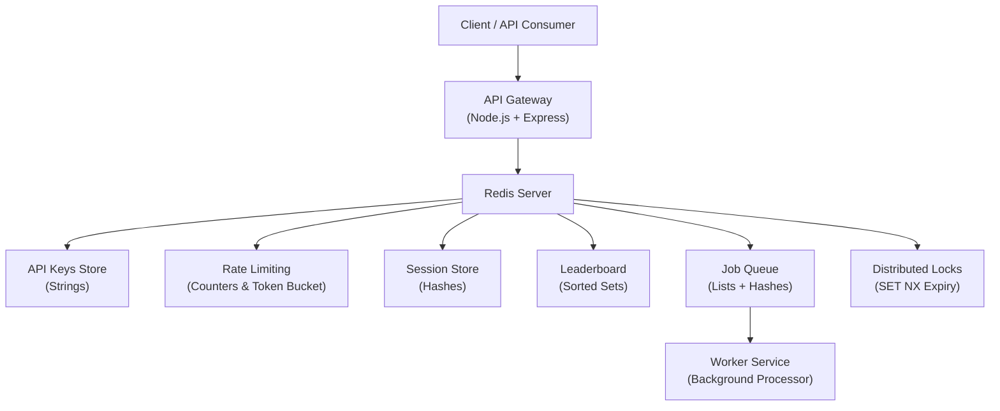
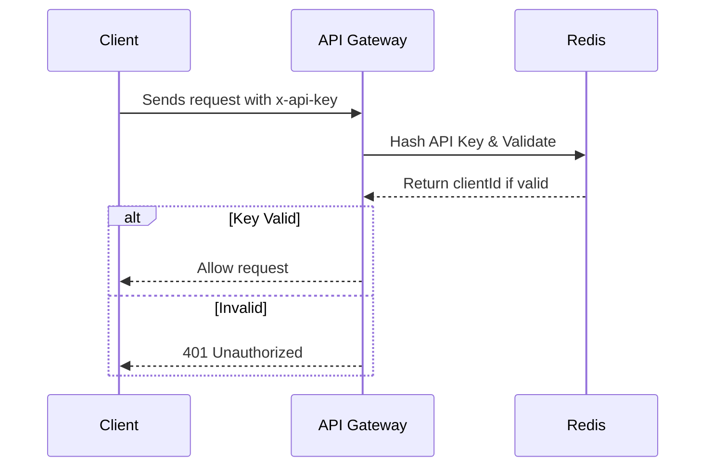
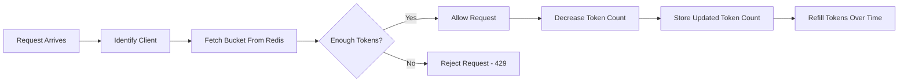
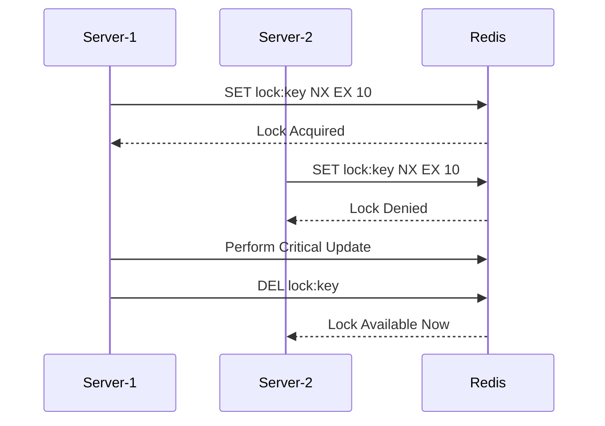
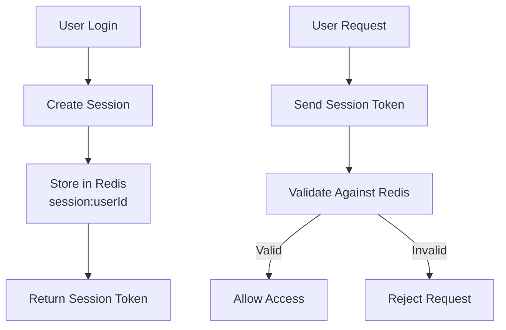
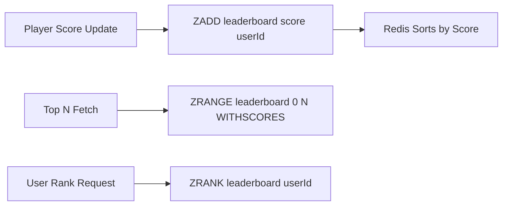
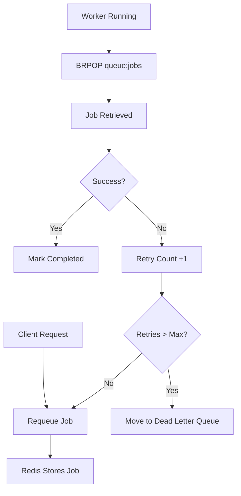
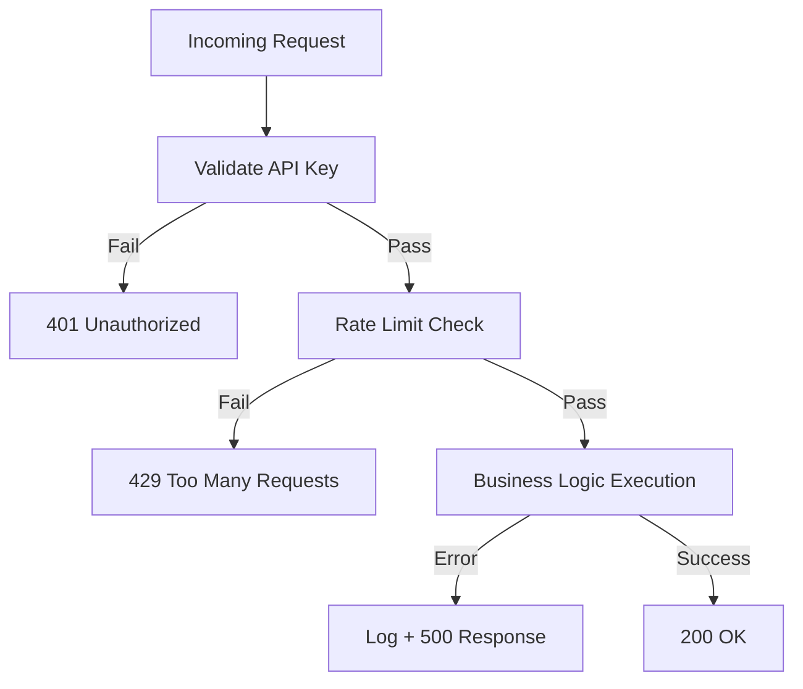

# 🚀 Redis Systems Toolkit — Distributed Backend System (Node.js + Redis)

A **backend system** built using **Node.js & Redis** that showcases real-world distributed backend patterns used in industry.

This backend toolkit includes:

✔ API Key Authentication  
✔ Rate Limiting (Fixed Window & Token Bucket)  
✔ Distributed Locking  
✔ Session Storage  
✔ Leaderboard System  
✔ Job Queue with Retry & Dead-Letter Queue  
✔ Worker System  

> This project goes beyond CRUD — it demonstrates real backend engineering & system design.

---

## 📑 Table of Contents

- About The Project
- Key Features
- System Architecture
- Tech Stack
- Redis Data Modeling
- Project Structure
- Setup & Installation
- Environment Variables
- Running The Project
- API Documentation
- Feature Deep-Dive (with diagrams)
- Postman Testing (Screenshots)
- Error Handling & Edge Cases
- Security Practices
- Performance & Scalability
- Real-World Use Cases
- Learning Outcomes
- Future Enhancements
- Screenshots Gallery
- Credits

---

## 🧠 About The Project

Modern backend systems don’t just store data — they manage authentication, security, traffic control, distributed consistency & async processing.

This project was built to **learn & demonstrate backend system architecture using Redis as the core infrastructure layer.**

It acts like a **mini API-Gateway + Job Processor**, inspired by platforms like Stripe, Uber & Slack.

---

## ⭐ Key Features

- 🔑 Secure API Key Authentication
- 🚦 Advanced Rate Limiting
- 🔒 Distributed Lock Mechanism
- 🔐 Redis-based Session Store
- 🏆 Leaderboard using Redis Sorted-Sets
- 📬 Job Queue & Worker System
- ♻ Retry & Dead-Letter Queue
- 🧱 Layered Architecture (Controller → Service → Redis)

---

## 🏗 System Architecture

This project follows an **API Gateway Architecture**.  
All client requests go through a central gateway (Express server). Redis acts as the core infrastructure layer powering authentication, rate-limiting, session storage, async queues, and leaderboard ranking. Background workers process jobs independently.

## 🏗 System Architecture

This project follows an **API Gateway Architecture**.  
All client requests go through a central gateway (Express server). Redis acts as the core infrastructure layer powering authentication, rate-limiting, session storage, async queues, and leaderboard ranking. Background workers process jobs independently.




## 🔑 API Key Authentication Flow

Client authentication is enforced via API Keys. Keys are hashed and stored in Redis. Each request contains the key in headers.



## 🚦 Rate Limiting — Token Bucket

The system prevents abuse using Token Bucket rate-limit strategy.



## 🔒 Distributed Lock Flow

Used to prevent race conditions such as rotating API keys simultaneously from multiple servers.



## 🔐 Session Storage Flow

Sessions are stored in Redis instead of JWT-only auth.



## 🏆 Leaderboard Ranking Flow

Leaderboard uses Redis Sorted Sets.



## 📬 Job Queue & Worker System

Jobs are processed in background without blocking API responses.



## ⚠ Error Handling Strategy



---

## 🛠 Tech Stack

| Layer | Tool |
|------|------|
| Runtime | Node.js |
| Framework | Express |
| Data Store | Redis |
| ORM/Client | ioredis |
| Testing | Postman |
| Config | dotenv |

---

## 🗄 Redis Data Modeling

| Purpose | Key Pattern | Type |
|--------|-------------|------|
| API Keys | `apiKey:<hash>` | String |
| Clients | `client:<id>:meta` | Hash |
| Sessions | `session:<userId>` | Hash |
| Rate Limit | `ratelimit:<client>:<window>` | String |
| Leaderboard | `leaderboard:zset` | Sorted Set |
| Job Queue | `queue:jobs` | List |
| Dead Queue | `queue:dead` | List |
| Job Data | `job:<id>` | Hash |
| Distributed Lock | `lock:<resource>` | String |

Each structure is chosen based on **time-complexity & reliability needs.**

---

## 📂 Project Structure
src/
├ controllers/
├ services/
├ routes/
├ middleware/
├ workers/
├ utils/
├ config/

🧠 **Why this structure?**
✔ Separation of concerns  
✔ Testable  
✔ Maintainable  
✔ Real-world style  

---

## ⚙️ Setup & Installation

```bash
git clone <repo-url>
cd project-folder
npm install

# Start Redis
Linux/Mac: redis-server
Windows: Use WSL or Redis service

PORT=3000
REDIS_HOST=127.0.0.1
REDIS_PORT=6379
API_KEY_RETENTION=2
API_KEY_GRACE_PERIOD_SECONDS=604800
```

---

## Running The Project

# Start API Server
node server.js

# Start Job Worker
node src/workers/jobWorker.js

---

## 📡API Documentation

All secured APIs require:
x-api-key: <client key>

# 🔑Client APIs

**Create Client**
POST /clients/createCLient

**Rotate API Key**
POST/clients/rotateKey/:id

# 🚧 Protected APIs (Rate Limited)

**Get Client Info**
GET/clients/client/:id

**Leaderboard APIs**
POST /leaderboard/score
GET /leaderboard/top
GET /leaderboard/rank/:userId
GET /leaderboard/page
GET /leaderboard/score/:userId
DELETE /leaderboard/delete/:userId
DELETE /leaderboard/reset

**Job Queue APIs**
POST /jobs/create
GET /jobs/status/:id

---

## 🔍 Feature Deep-Dive

# API Key Authentication
-clients receive secure key
-stored hashed in Redis
-lookup at request time
-supports rotation

# Rate Limiting
**Patterns implemented**
-Fixed Window Counter
-Token Bucket

# Distributed Lock
-Ensures only one server can mutate a shared resource at a time.
-Prevents race conditions.

# Session Store
**Redis used because**
✔ fast
✔ scalable
✔ persistent

# Leaderboard
**Implemented using Sorted-Sets**
ZADD leaderboard score userId
ZRANGE leaderboard 0 9 WITHSCORES

# Job Queue & Worker
**Supports**
✔ enqueue
✔ processing
✔ retries
✔ DLQ

Just like:
-BullMQ
-Sidekiq
-Celery

---

## ⚠ Error Handling & Edge Cases
-Invalid key

-Expired session

-Retries exceeded

-Redis offline fallback

-DLQ handling

---

## 🔐 Security Practices

✔ API keys hashed
✔ env-based secrets
✔ middleware validation
✔ rate limiting enabled
✔ no sensitive logs

---

## ⚡Performance & Scalability

**Redis gives**
-O(1) atomic ops

-Shared cluster state

-Horizontal scaling

-Async workloads

-Supports real-world scale.

---

## 🌎 Real-World Use Cases

-API gateway

-Auth platform

-Gaming backend

-Analytics system

-Microservice infra

-SaaS rate-limiting

---

## 📚 Learning Outcomes

-Redis internals

-System design

-Rate-limit patterns

-Distributed locks

-Async job systems

-Middleware architecture

-Debugging distributed flows

-Production thinking

---

## 🔮 Future Enhancements
-Metrics & monitoring

-Dashboard UI

-Delayed jobs

-Priority queues

-Docker deploy

-OAuth login

-Mail notifications

## 🙌 Credits

This project was designed and implemented independently for learning
advanced backend system design with Redis and Node.js.

Special thanks to:

- Redis documentation & community examples
- Node.js & Express ecosystem
- Open source learning resources

Built for improving backend engineering skills.

---

## License

This project is licensed under the MIT License:

See the [LICENSE.md](LICENSE.md) file for full details.
